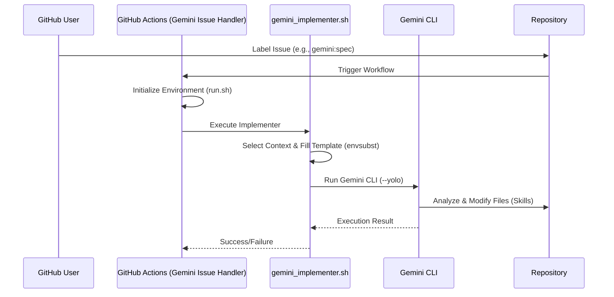

# Gemini Issue Handler 詳細仕様書

## 概要
GitHub Issues のラベルをトリガーに、適切な Gemini エージェント（SYSTEM_ARCHITECT, TECHNICAL_DESIGNER, BACKENDCODER）を自律的に起動し、要件定義から詳細設計、コード実装までを自動化するためのワークフロー。

## 関連ドキュメント
- **Workflow Definition:** `.github/workflows/gemini-handler.yml`
- **Implementation Script:** `.github/workflows/script/gemini_implementer.sh`
- **Context Templates:** `.github/workflows/context/*.md`

## 実行フロー (Logic / Flow)

### 1. トリガー (Trigger)
- **GitHub Event:** `issues`
- **Types:** `opened`, `labeled`
- **フィルタ:** `gemini:arch`, `gemini:spec`, `gemini:tdd` のいずれかのラベルが含まれている場合のみジョブが実行される。

### 2. ロール選択ロジック (Role Selection)
付与されたラベルに応じて、エージェントのロール（`AGENT_ROLE`）と使用するコンテキストプロンプトが以下のように決定される。

| ラベル | エージェントロール (AGENT_ROLE) | コンテキストファイル | 実行スキル (想定) |
| :--- | :--- | :--- | :--- |
| `gemini:arch` | `SYSTEM_ARCHITECT` | `arch-prompt.md` | Architecture Drafting |
| `gemini:spec` | `TECHNICAL_DESIGNER` | `spec-prompt.md` | Specification Drafting |
| `gemini:tdd` | `BACKENDCODER` | `tdd-prompt.md` | TDD Implementation |

### 3. 処理ステップ
1.  **Checkout:** 最新のソースコードを取得。
2.  **Environment Initialization:** `.build/run.sh` を実行し、仮想環境や Gemini CLI 等の依存関係をセットアップ。
3.  **Implementer Phase:** `gemini_implementer.sh` を起動。
    - `ISSUE_LABELS` から対象スキルを特定。
    - `envsubst` を使用し、Issue の内容（番号、タイトル、本文）をプロンプトテンプレートに埋め込む。
    - `gemini` CLI を `--yolo` モードで実行し、指定されたモデル（`gemini-3-flash-preview`）でタスクを遂行させる。

## シーケンス図 (Sequence Diagram)

## 補足・制約事項
- **排他制御:** 一つの Issue に複数の `gemini:*` ラベルが付与されている場合、`gemini_implementer.sh` はエラーを出力して終了する（Match Count > 1 チェック）。
- **セキュリティ:** `envsubst` を使用する際は、意図しない環境変数の展開を防ぐため、置換対象の変数をホワイトリスト（`$ISSUE_NUMBER $ISSUE_TITLE $ISSUE_BODY`）で制限している。
- **モデル:** 現在は `gemini-3-flash-preview` をデフォルトモデルとして使用している。
- **エラーハンドリング:** `gemini` コマンドが不在の場合や、コンテキストファイルが見つからない場合は非ゼロの終了コードで異常終了する。

## 検証基準 (Verification Criteria)
- **Happy Path:** `gemini:spec` ラベルを付与して Issue を作成した際、Actions が正常に完了し、該当する設計ドキュメントが更新または生成されていること。
- **Edge Cases:**
    - ラベルがない場合はジョブがスキップされること。
    - 複数の `gemini:*` ラベルがある場合はエラー終了すること。
    - 必要なコンテキストファイルが欠落している場合はエラー終了すること。
