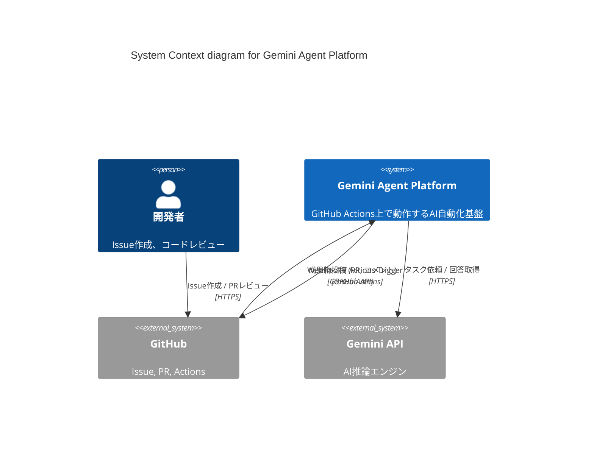

# システムコンテキスト: Gemini Agent Platform

このドキュメントは、システムの全体像、境界、および主要な依存関係を定義する、プロジェクトの Single Source of Truth (SSOT) です。

- **Status**: 承認済み
- **Last Updated**: 2026-02-03

## 1. ビジネスコンテキストとアウトカム
本システムは、GitHub上のIssueやPull Requestをトリガーとして、AI（Gemini）エージェントが自律的にソフトウェアエンジニアリングタスク（設計、仕様策定、実装、レビュー分析）を実行することを目的とする。
これにより、開発プロセスの自動化、ドキュメントとコードの整合性維持、および開発者の生産性向上を実現する。

## 2. 主要なユビキタス言語 (Ubiquitous Language Core)
| 用語 | 定義 | 備考 |
| :--- | :--- | :--- |
| エージェント | 特定の役割（Role）とスキル（Skill）を持ち、タスクを実行するAI。 | |
| スキル | エージェントが実行可能な、構造化された作業手順（Markdown形式で定義）。 | |
| SSOT | Single Source of Truth。本プロジェクトでは `reqs/` および `docs/` 下のドキュメントを指す。 | |
| Handler | GitHub Events を検知し、適切なエージェントとスキルを起動する仕組み。 | |

## 3. システムの境界と責務 (System Boundary)

### 3.1 スコープ内 (In-Scope)
- GitHub Events (Issues, PRs) の検知とパース。
- エージェント（SYSTEM_ARCHITECT, TECHNICAL_DESIGNER, BACKENDCODER）のオーケストレーション。
- Gemini API を用いたタスク実行。
- 成果物（PR, コメント, ドキュメント更新）の生成。

### 3.2 スコープ外 (Out-of-Scope)
- GitHub 自体のインフラ管理。
- Gemini モデル自体のトレーニング。
- 人間による最終承認（PRのマージなど）。

## 4. アクターと外部システム (Actors & External Systems)

### 4.1 アクター (ユーザー)
| アクター名 | 役割 / 目的 |
| :--- | :--- |
| 開発者 | Issueを作成し、タスクをエージェントに依頼する。成果物をレビューする。 |
| レビュアー | エージェントが作成したPRやコメントをレビューする。 |

### 4.2 外部システム
| システム名 | 連携内容 / プロトコル |
| :--- | :--- |
| GitHub | ソースコード管理、Issue管理、PR管理、Actions実行環境。 |
| Gemini API | LLMによる思考、コード生成、分析。 / HTTPS (REST) |

## 5. アーキテクチャ図 (C4 Model - System Context)

## 6. 戦略的トレードオフと 4 大リスク
- **(自律性 vs 制御):** エージェントに高い自律性を与える一方で、`--yolo` モードの使用は慎重に行い、重要な変更は必ず人間がレビューする。
- **(コスト vs パフォーマンス):** `gemini-3-flash-preview` などの軽量・高速モデルを優先しつつ、複雑なタスクには上位モデルの検討も行う。
- **(最大のリスク):** AIによる誤ったコード生成や、意図しないドキュメントの破壊。

## 7. 設計原則とデータ信頼性 (Design Principles & Kleppmann's View)
- **(原則1):** 成果物は常に SSOT (Docs/Reqs) と整合していなければならない。
- **(原則2):** すべての自動化ロジックは、それ自体が仕様化され、テスト可能であること（本仕様書の目的）。
- **(原則3):** エージェントの挙動は「スキル」として外部化され、透過的に改善可能であること。
